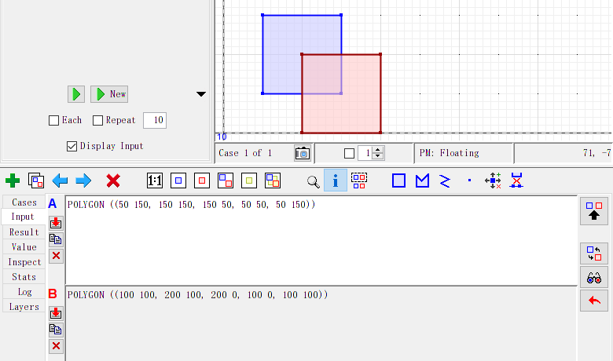
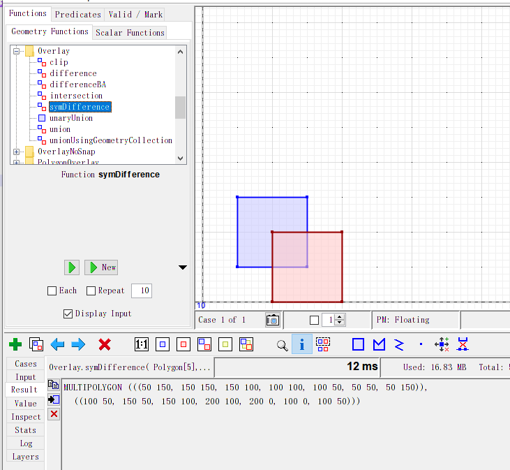
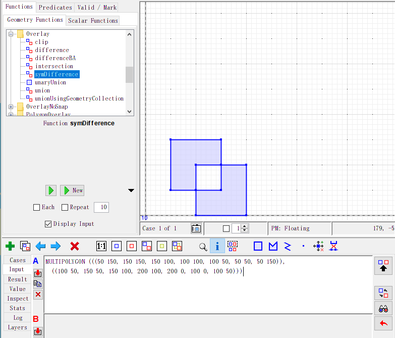
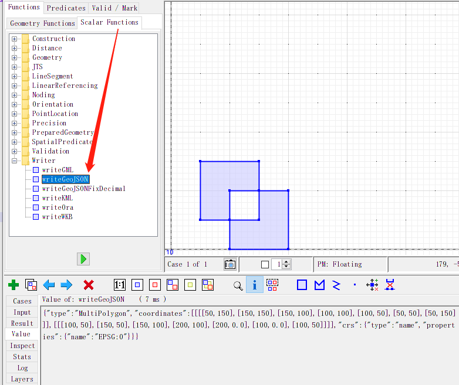

### 构建可视化程序

[https://github.com/locationtech/jts/blob/master/doc/JTSTestBuilder.md](https://github.com/locationtech/jts/blob/master/doc/JTSTestBuilder.md)


1. 先把源码pull下来
2. package `modules/app` 模块
3. 通过 `>java -jar JTSTestBuilder.jar` 运行

### 演示demo

输入俩几何体 A和B （可绘制，也可手动输入polygon）



执行一些函数查看结果，比如 `symDifference`



这里没显示出效果，可以把结果copy到输入：



还可以转换成其他格式，比较方便, 比如转成geojson格式



### 使用程序实现

```java
	// 从WKT里创建几何体
	WKTReader wktReader = new WKTReader();
	Geometry a = wktReader.read("POLYGON ((50 150, 150 150, 150 50, 50 50, 50 150))");
	// Geometry b = wktReader.read("POLYGON ((100 100, 200 100, 200 0, 100 0, 100 100))");

	// 用工厂方法创建
	GeometryFactory factory = new GeometryFactory();
	Polygon b = factory.createPolygon(new Coordinate[]{
			new Coordinate(100, 100),
			new Coordinate(200, 100),
			new Coordinate(200, 0),
			new Coordinate(100, 0),
			new Coordinate(100, 100),
	});

	// 关系运算
	Geometry res = a.symDifference(b);
	System.out.println(res.toText());

	// 输出不同的格式
	// WKTWriter wktWriter = new WKTWriter();
	GeoJsonWriter geoJsonWriter = new GeoJsonWriter();
	String json = geoJsonWriter.write(res);
	System.out.println(json);
```

结果：
```json
MULTIPOLYGON (((50 150, 150 150, 150 100, 100 100, 100 50, 50 50, 50 150)), ((100 50, 150 50, 150 100, 200 100, 200 0, 100 0, 100 50)))
{"type":"MultiPolygon","coordinates":[[[[50,150],[150,150],[150,100],[100,100],[100,50],[50,50],[50,150]]],[[[100,50],[150,50],[150,100],[200,100],[200,0.0],[100,0.0],[100,50]]]],"crs":{"type":"name","properties":{"name":"EPSG:0"}}}
```


